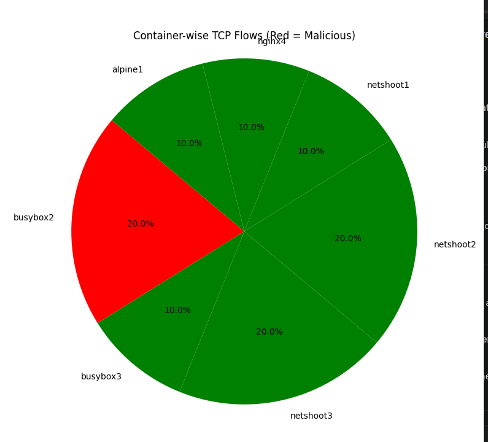

# 🧠 ContainerInsight-eBPF  
### Container-Aware Network Flow Profiling & Anomaly Detection with eBPF  



> **Cloud-native environments demand granular, real-time network visibility at the container level.**  
> This project integrates **Docker** and **Linux eBPF** to deliver deep telemetry, intelligent profiling,  
> and live anomaly detection — enabling advanced observability and security in multi-tenant systems.

---

## 🚀 Features

- **Per-Container Flow Analysis:**  
  Capture real-time TCP flows (source/destination IPs, ports, protocols) for each container using eBPF.  

- **Anomaly Detection:**  
  Identify and visualize suspicious flows such as unauthorized outbound traffic or port scans in microservices.  

- **Live Visualization:**  
  Animated pie charts show container activity and potential threats, distinguishing malicious actors in real time.  

- **Cloud-Native Ready:**  
  Demonstrates applicability for Kubernetes, Docker Swarm, or standalone Docker deployments.  

---

## 🛠️ Technologies Used

| Category | Tools & Technologies |
|-----------|----------------------|
| **Containerization** | Docker |
| **Telemetry** | eBPF (Extended Berkeley Packet Filter) |
| **Monitoring & Visualization** | Python, Matplotlib |
| **Storage** | SQLite |
| **Automation** | Bash (demo.sh) |

---

## 📦 Quick Start

### 1️⃣ Clone the Repository
```bash
git clone https://github.com/Abhishek6126/ContainerInsight-eBPF.git
cd ContainerInsight-eBPF
```
---

## 2️⃣ Start Containers & Generate Traffic
```bash
./demo.sh
```

## 3️⃣ Monitor Network Flows with eBPF
(Automatically launched by demo.sh, or run manually)
```bash
sudo python3 tcpmonitor.py
```


## 4️⃣ Visualize Live TCP Flow Data
```bash
python3 visualize.py
```

---

## 📝 Project Highlights

- **Profiles microservice-level network traffic** (web, database, background containers)
- **Detects unauthorized flows, lateral movements, and potential port-scan activity**
- **Provides an extensible foundation for network forensics and cloud-native security**

---

## 📚 How It Works

**Container Setup:**  
Multiple Docker containers (representing microservices) are launched on a shared custom network.

**Monitoring Layer:**  
eBPF attaches to kernel-level socket events, logging TCP flows enriched with container metadata.

**Anomaly Detection Engine:**  
Python scripts apply detection rules or heuristics to flag anomalies based on frequency, direction, or target IPs.

**Visualization Layer:**  
Real-time animated dashboards (Matplotlib) visualize per-container network activity, highlighting malicious flows.

---

## 📈 Example Architecture Diagram

+------------------------------+
| Docker Containers |
| (Web, DB, Cache, etc.) |
+--------------+---------------+
|
eBPF Kernel Hooks
|
+------+------+
| Flow Logger |
| (tcpmonitor)|
+------+------+
|
SQLite / JSON
|
+------+------+
| Visualizer |
| (Python GUI)|
+-------------+

---

## ✨ Contributing

Contributions, ideas, and PRs are welcome!  
Whether you want to enhance anomaly detection, optimize eBPF programs, or improve visualization — your input is valuable.


🧩 For technical deep dives, refer to in-code documentation and comments.  

© 2025 Abhishek Pandey
